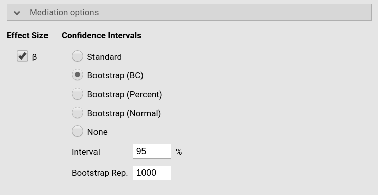

```{r echo=FALSE,results='hide'}
source("../R/functions.R")
```


`r keywords("Mediation, simple mediation")`

This example shows how to estimate a simple mediation model with three variables in jAMM. Data come from [University of Virginia Research Data Service]('http://static.lib.virginia.edu/statlab/materials/data/mediationData.csv') and contain variables related to school achievement in a sample of students. There are three variables, school `grades`, `self-esteem`, and `happiness`, measured on quantitative scales (I renamed the variables to make the data more intuitive, with `X=grades`, `M=selfesteem` and `Y=happiness`. We also defined the variables as continuous in the data tab). The mediation model, explained [here](https://data.library.virginia.edu/introduction-to-mediation-analysis/), is a classical simple mediation, as shown in the Figure.


# jAMM

First, we launch the module under `linear models` menu. You can see in the results panel (right) that a simple mediation model path diagram is ready to be filled by selecting variables (left).


# Input

In case of simple mediation, we simply need to define the role of the variables. So, we put `happiness` in the `Dependent Variable` field, `selfesteem` in the `Mediators` field, and `grades` in the `Covariates` (continuous independent variables) field.

When you define the variables role, the module understands the mediation model and updates the path diagram.


# The model

In case of simple mediation, the module understands the intended statistical model, that can be checked in the `Mediators models` and `Full model` tabs. 


The tabs simply indicate that the mediation model is composed by a linear regression with `selfesteem` as dependent and `grades` as independent, and one regression with `happiness` as dependent and `selfesteem` and `grades` as independent variables. These two models are also reported in the `Model info` result table.


In the `Model info` table you can also see how the module deduced what is the mediated effect to be computed, in our example `grades -> selfesteem -> happiness`.

In the mediation literature notation, these models are usually referred to as:

$$ M =k_1 + a \cdot X $$

$$ Y =k_2+ b \cdot M +  c^\prime \cdot X$$
($k_i$  are intercepts)

# Results

Results report indirect (mediated), direct (unmediated) and total effects, under the `Mediation` section, in the `Indirect and direct effects`.


The `Indirect` row reports the _mediated effect_. Thus, this is the classical $a \cdot b$ mediation effect, where $a$ is the coefficient from `grades` to `selfesteem` and $b$ is the coefficient from `selfesteem` to `happiness`, keeping constant `grades`. Coefficients $a$ and $b$ are the components of the mediated effect, and you can see them in the table in the `Component` rows. As expected, $a \cdot b= .5610 \cdot .6355 = .3565$. 

The `z` test associated with the mediated effect is the _large sample_ z test of the mediated effect, which is a slightly more accurate version of the Sobel test. The confidence intervals are also computed using _large sample_ approximation, but the bootstrap version of confidence intervals can be asked in the `Mediation options` tab (see below).

The `Direct` row shows the effect of the independent variable not mediated by `EXP`, again for the average level of `SVO`, the coefficient usually denoted by $c^\prime$ in the mediation jargon. The `Total` effect is the overall effect of `PRIME` on `BEH`, for the average level of `SVO`, that is $c=a \cdot b + c^\prime$. All the `z` tests associated with these coefficients test the null-hypothesis that the corresponding coefficient is zero. Confidence intervals are computed with the same method used for the indirect effect.

Finally, the $\beta$ column shows the standardized solution coefficients.

# Confidence intervals

By default, the jAMM computes the confidence intervals using the _large sample_ delta method, that is using the z test as the starting point of computation. However, often users prefer to use a bootstrap method. That can be done in the  `Mediation options` tab.



Several bootstrap methods can be selected. One of the most used in mediation analysis is the _precentile_ method, which is jAMM is called `bootstrap (Percent)`. See `r link_pages(nickname="glm_help")` for help on the other options. Please note that the bootstrap method can be very time-consuming and slow.


To recap, to estimate a simple mediation model, simply select the dependent, the independent, and the mediator variable, and the results will be shown in the results table.


If you are interested in checking the convergence of jAMM results with other software results, please visit the rosetta store
`r link_pages(nickname="ros_moderation")`

# Other examples

`r include_examples("glm")`


`r issues()`